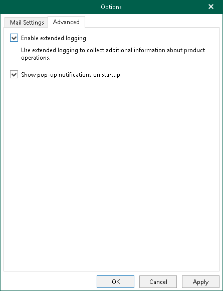

# Advanced Settings

Veeam Explorer for Microsoft OneDrive for Business allows you to configure advanced settings such as extended logging mode and pop-up notifications.

To configure advanced settings, do the following:

1. In the main menu, click General Options.
2. Open the Advanced tab.

1. If you want to enable extended logging mode to collect logs that contain additional information on specific operations, select the Enable extended logging check box. After enabling extended logging mode, you can go back to the application and perform actions for which you want to collect additional information. Then you can collect logs. For more information on log collection, see [Getting Support](veod_support.md).
2. By default, Veeam Explorer for Microsoft OneDrive for Business displays notifications when loading backups created by Veeam Backup for Microsoft 365 from object storage repository. If you want to disable these notifications, clear the Show pop-up notifications on startup check box.
3. Click OK.

