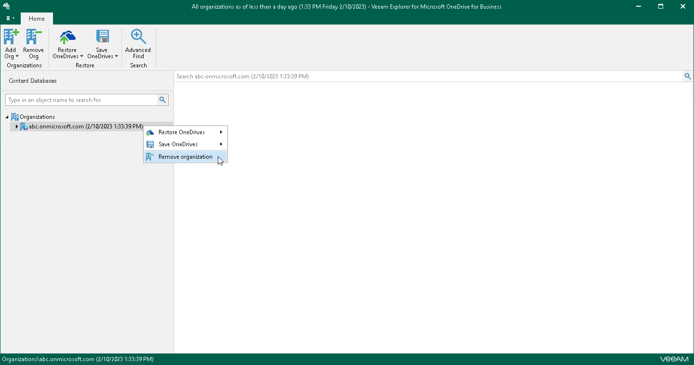

# Removing Organizations

In this article

Veeam Explorer for Microsoft OneDrive for Business allows you to remove an organization from the application scope when you no longer need it.

To remove an organization from the application scope, right-click an organization in the navigation pane and select Remove organization.

Page updated 10/6/2025

Page content applies to build 13.0.1.1071
