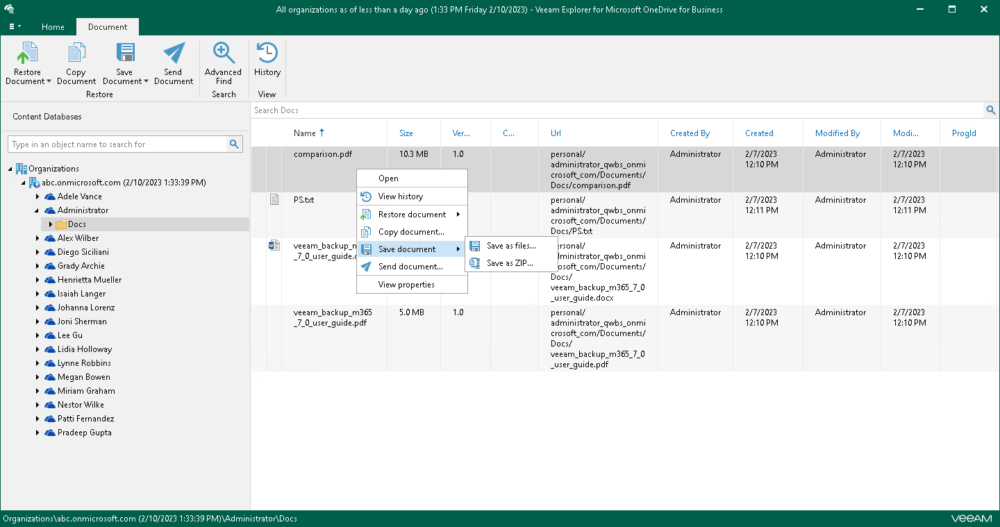

# Saving Microsoft OneDrive Documents and Folders

Veeam Explorer for Microsoft OneDrive for Business allows you to save documents and folders located in Microsoft OneDrive to a specified location.

To save a folder, do the following:

1. In the navigation pane, do one of the following:

* Select a folder that you want to save, and on the Folder tab, click Save Folder > Save folder as files or Save Folder > Save folder as ZIP.
* Right-click a folder and select Save folder > Save folder as files or Save folder > Save folder as ZIP.

1. In the displayed window, browse to the necessary folder and click Select Folder or Save.

Keep in mind that if you select the Save as ZIP option, Veeam Explorer for Microsoft OneDrive for Business will save a folder to an archive with the archive.zip name.

To save a document, do the following:

1. In the preview pane, do one of the following:

* Select a document that you want to save, and on the Document tab, click Save Document > Save as files or Save Document > Save as ZIP.
* Right-click a document and select Save document > Save as files or Save document > Save as ZIP.

1. In the displayed window, browse to the necessary folder and click Select Folder or Save.

Keep in mind that if you select the Save as ZIP option, Veeam Explorer for Microsoft OneDrive for Business will save a document to an archive with the archive.zip name.

