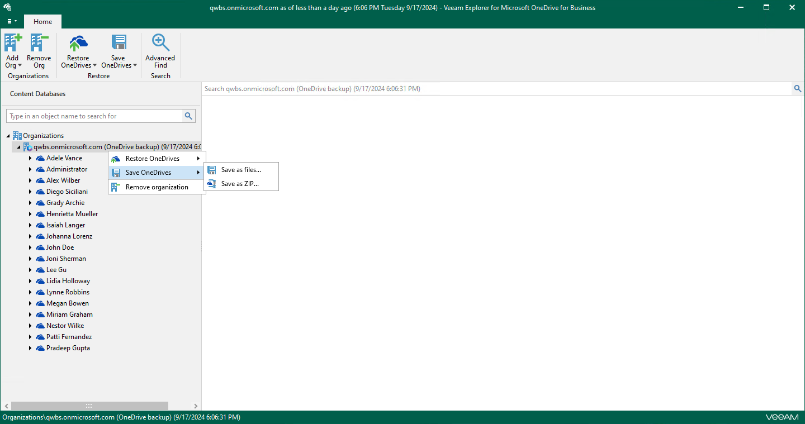
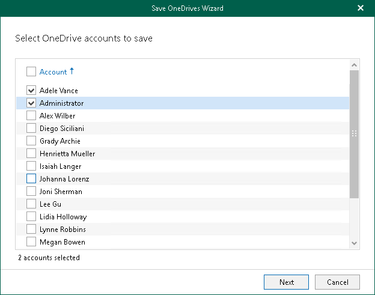
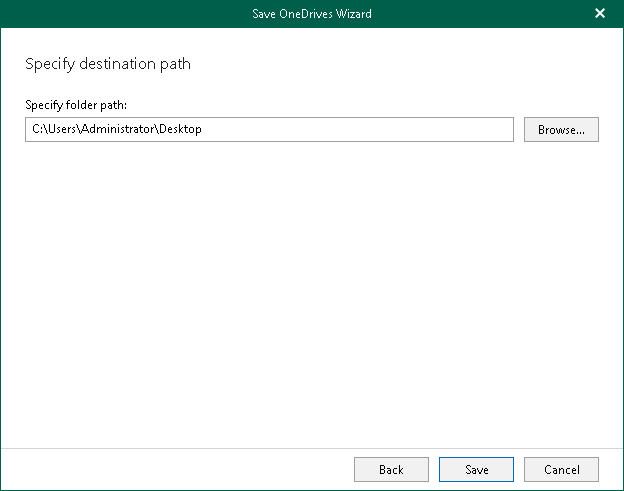
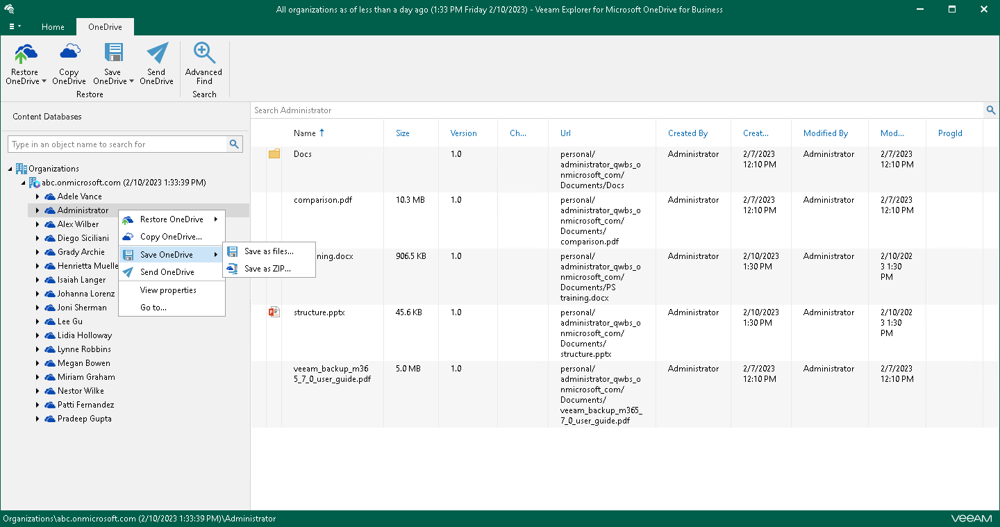

# Saving Microsoft OneDrives

Veeam Explorer for Microsoft OneDrive for Business allows you to save OneDrive content to the specified location.

Saving Multiple OneDrives

To save data of multiple OneDrives, do the following:

1. In the navigation pane, do one of the following:

* Select an organization with OneDrives, and on the Home tab, click Save OneDrives and select how you want to save data:

* Save as files. Select this option if you want to save each file separately to a specified location.
* Save as ZIP. Select this option if you want to add saved files to a ZIP archive and save the resulting archive to a specified location. Veeam Explorer for Microsoft OneDrive for Business will save files to an archive with the OneDrives\_<timestamp>.zip name.

* Right-click an organization with OneDrives and select Save OneDrives > Save as files or Save OneDrives > Save as ZIP.

1. In the Save OneDrives Wizard wizard, select OneDrive accounts to save.

1. Specify a folder where to save OneDrive data and click Save.

Saving Individual OneDrives

To save data of a specific OneDrive, do one of the following:

* In the navigation pane, select OneDrive, and on the OneDrive tab, click Save OneDrive and select how you want to save data:

* Save as files. Select this option if you want to save each file separately to a specified location. To specify a location, in the displayed window, browse to the necessary folder and click Select Folder.

* Save as ZIP. Select this option if you want to add saved files to a ZIP archive and save the resulting archive to a specified location. To specify a location, in the displayed window, browse to the necessary folder and click Save. Veeam Explorer for Microsoft OneDrive for Business will save files to an archive with the <user\_name>.zip name in this folder.

* In the navigation pane, right-click OneDrive and select Save OneDrive > Save as files or Save OneDrive > Save as ZIP.

