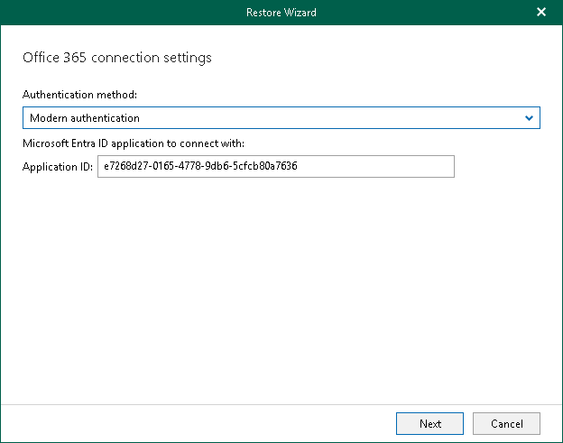
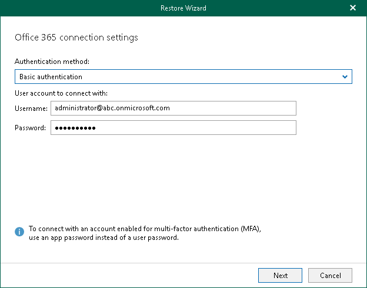

# Step 2. Select Authentication Method

At this step of the wizard, select either modern or basic authentication and specify authentication settings.

Modern Authentication

To use modern authentication, do the following:

1. From the Authentication method drop-down list, select Modern authentication.

This will allow Veeam Backup for Microsoft 365 to use a Microsoft Entra application for data restore. Such an application is used to restore the specified object back to Microsoft 365 organizations with enabled multi-factor authentication (MFA). For more information, see the [Adding Microsoft 365 Organizations](https://helpcenter.veeam.com/docs/vbo365/guide/vbo_add_office365_org.html?ver=80) section of the Veeam Backup for Microsoft 365 User Guide.

1. In the Application ID field, enter an identification number of the Microsoft Entra application that you want to use for data restore.

By default, Veeam Explorer for Microsoft OneDrive for Business populates this field with the identification number of the application that was used during a backup session. If you want to use another application, make sure to grant this application required permissions. For more information, see the [Microsoft Entra Application Permissions](https://helpcenter.veeam.com/docs/vbo365/guide/azure_ad_applications.html?ver=80) section of the Veeam Backup for Microsoft 365 User Guide.

Basic Authentication

To use basic authentication, do the following:

1. From the Authentication method drop-down list, select Basic authentication.
2. In the Username and Password fields, enter credentials to connect to the SharePoint organization.

