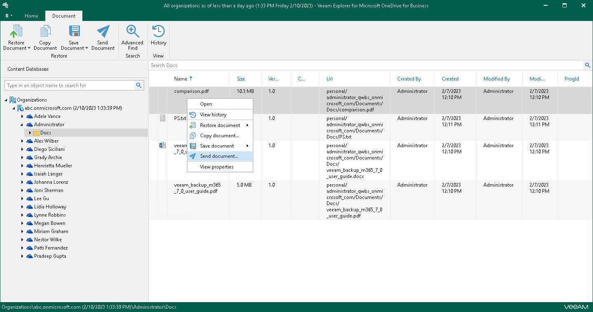
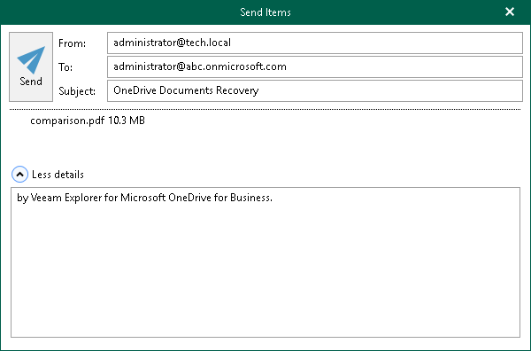

# Sending Microsoft OneDrive Data

Veeam Explorer for Microsoft OneDrive for Business allows you to send OneDrive data to specified recipients by email.

|  |
| --- |
| Note |
| Before sending documents, make sure to configure mail settings. The amount of data you can send at a time depends on your SMTP server configuration. For more information about configuring mail settings, see [Mail Settings](veod_mail_settings.md). |

To send OneDrive data by email, do the following:

1. Depending on the type of object you want to send, the following actions are available:

* To send OneDrive, do one of the following:

* In the navigation pane, select OneDrive that you want to send, and on the OneDrive tab, click Send OneDrive.
* In the navigation pane, right-click OneDrive and select Send OneDrive.

* To send a folder, do one of the following:

* In the navigation pane, select a folder that you want to send, and on the Folder tab, click Send Folder.
* In the navigation pane, right-click a folder and select Send folder.

* To send a document, in the navigation pane, select a folder that contains the document that you want to send, and then do one of the following:

* In the preview pane, select a document, and on the Document tab, click Send Document.

* In the preview pane, right-click a document and select Send document.

1. In the Send Items window, provide a recipient address and click Send.

The From field is filled automatically based on the address you have provided when configuring mail settings.

You can also edit the message subject and body. To edit the message body, click More details.

