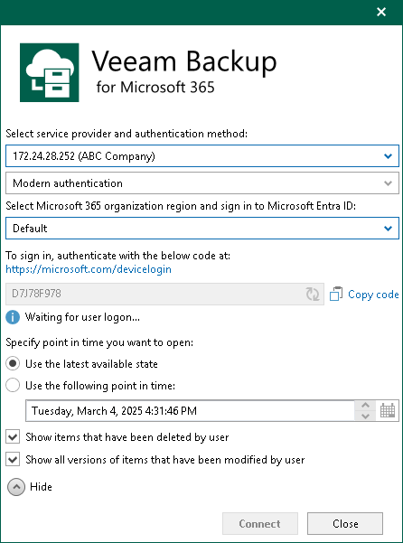

# Adding Veeam Backup for Microsoft 365 Service Provider

In Veeam Explorer for Microsoft OneDrive for Business, you can connect to a service provider server to add its backups to the application scope and recover data directly from such backups.

|  |
| --- |
| Note |
| Make sure that both Veeam Explorer for Microsoft OneDrive for Business and Veeam Backup & Replication are installed on the same server and at least one service provider is added to Veeam Backup & Replication. For more information, see the [Connecting to Service Providers](https://helpcenter.veeam.com/docs/vbr/cloud/cloud_connect_sp.html?ver=13) section of the Veeam Cloud Connect Guide. |

To add Veeam Backup for Microsoft 365 service providers, do the following:

1. Do one of the following:

* On the Home tab, click Add Org > Veeam Backup for Microsoft 365 service provider on the ribbon.
* Right-click the Organizations node and select Veeam Backup for Microsoft 365 service provider.

1. From the Select service provider and authentication method drop-down list, select a service provider that you want to add and select an authentication method that can be either Modern authentication or Basic authentication.
2. [For Modern authentication] Select a region to which a Microsoft 365 organization of the selected service provider belongs.

1. [For Modern authentication] Copy the device code and use it to sign in to Microsoft Identity platform.

For Basic authentication, you must enter a user name and password to connect to the service provider server.

|  |
| --- |
| Note |
| You cannot use Basic authentication to load backups if a Microsoft 365 organization has been added to the service provider infrastructure using Modern authentication. |

1. Select a point-in-time state as of which you want to load Microsoft 365 backups.

To select a point in time, use the calendar control.

1. Select the Show items that have been deleted by user check box to see all the items that were removed.
2. Select the Show all versions of items that have been modified by user check box if you want to load modified versions.
3. Click Connect.

