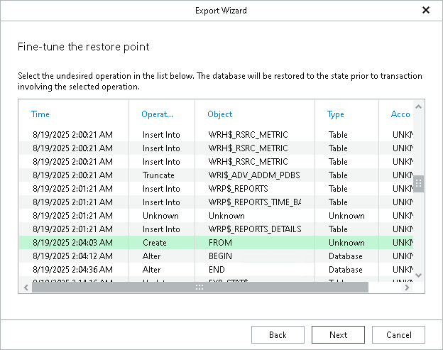

# Step 3. Fine-Tune Restore Point

In this article

At this step of the wizard, select an operation prior to which you want to export data.

|  |
| --- |
| Note |
| This step is available only if you have selected the Perform restore to the specific transaction check box at the [Specify Restore Point](veor_df_export_custom_srp.md) step of the wizard. |

Page updated 8/19/2025

Page content applies to build 13.0.1.1071
