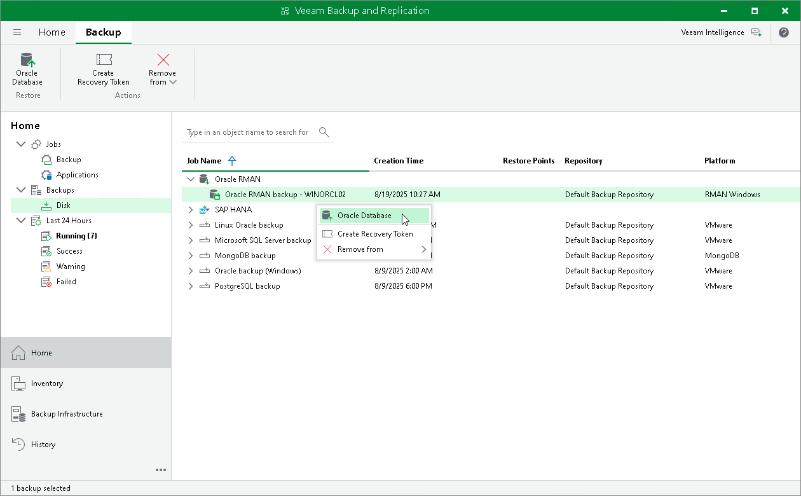

# Exploring RMAN Plug-in Backups

This section explains how to explore backups created with Veeam Plug-In for Oracle RMAN. For more information, see [Veeam Plug-In for Oracle RMAN](rman_plugin.md).

To load RMAN plug-in backups, do the following:

1. In the Veeam Backup & Replication console, open the Home view.
2. Go to the Backups > Disk node.
3. Right-click an RMAN plug-in backup and select Oracle Database.

Related Topics

[Restoring from RMAN Plug-in Backups](rman_backups.md)

