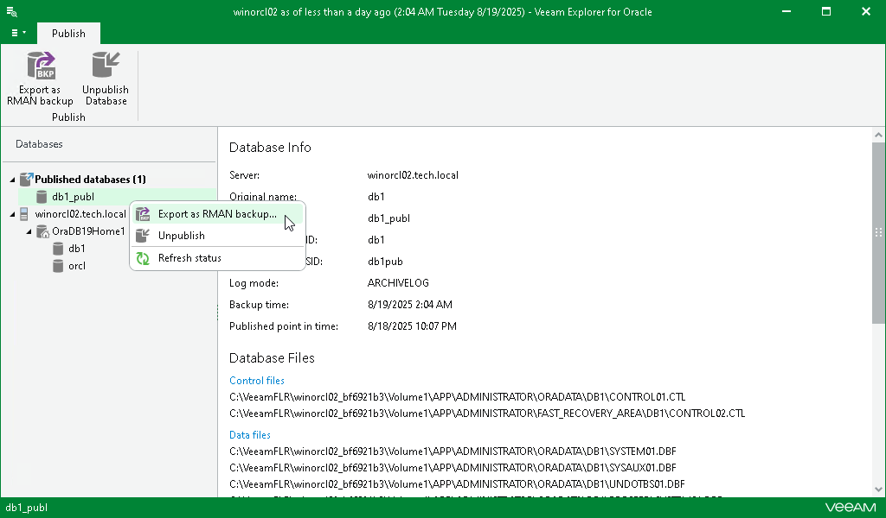

# Exporting as RMAN Backup

Once published, the database can be exported as an RMAN backup so that you can save the changes you may have made on the target server. For example, after publishing a database, you may have added a column or altered some values. To save these modifications before you unpublish the database, you can use the export feature.

When exporting published databases, you do not need a staging server. The RMAN backup is saved directly to the server onto which the database is published. Then, the RMAN backup is sent to the specified path on the machine where Veeam Explorer for Oracle is running.

To export a published database, do the following:

1. In the navigation pane, under the Published databases node, select a published database.
2. On the Publish tab, select Export as RMAN backup or right-click a published database and select Export as RMAN backup.

1. In the Export wizard, specify the export location.

1. In the Export path field, specify the path to which you want to export database files.

If the folder you are specifying does not exist, it will be created.

1. In the File name format field, specify the format according to which your files will be named after the export.

For more information, see [this Oracle article](https://docs.oracle.com/en/database/oracle/oracle-database/21/rcmrf/formatSpec.html?source=%3Aso%3Atw%3Aor%3Aawr%3Aore%3A%3A%3Aautonmousblog#GUID-E51F637A-57E0-4B06-803F-3F879DF5BEED).

1. In the Tag to label output file with field, specify a new tag name.
2. To compress files using native Oracle compression, select the Enable native compression check box.
3. In the Channels number numeric field, specify the number of channels to be used when retrieving Oracle databases from the backup.
4. Click Export.

1. After the export process is complete, review the results shown in the Database export summary window. To do this, click See more to expand the window and review details of the export operation.

You can filter notifications by their status: Error, Warning or Success.

