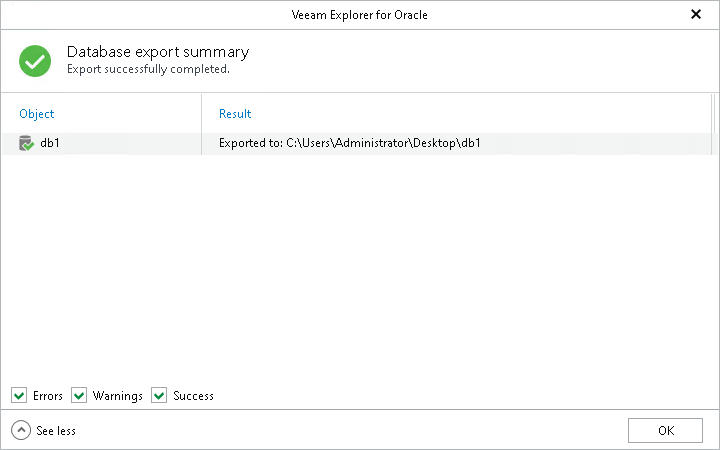

# Step 4. Review Export Summary

At the Database export summary step, click See more to expand the window and review details of the export operation.

You can filter notifications by their status: Error, Warning or Success.

