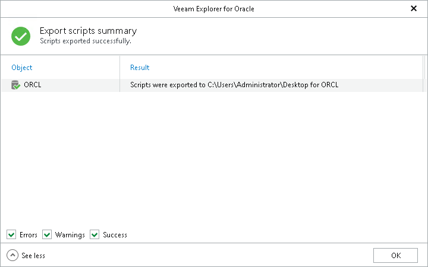

# Step 8. Review Export Summary

At the Export scripts summary step of the wizard, click See more to expand the window and review details of the export operation.

You can filter notifications by their status: Error, Warning or Success.

Page updated 2026-07-16

