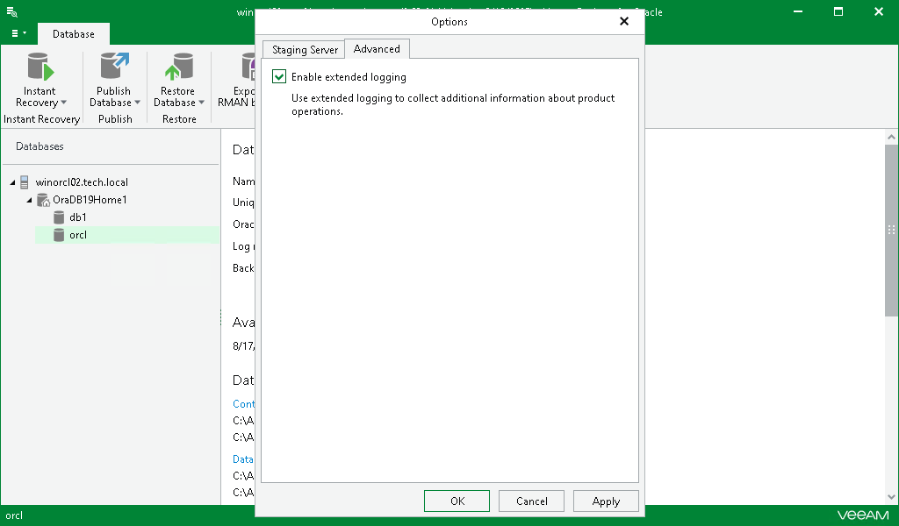

# Enabling Extended Logging

In this article

Veeam Explorer for Oracle allows you to enable an extended logging mode to collect logs that contain more details on specific operations. After you enable extended logging, you can go back to the application and perform the actions for which you want to collect additional information. Then you can collect the logs. For more information on log collection, see [Getting Support](veor_support.md).

To enable extended logging, do the following:

1. Go to the main menu and click General Options.
2. On the Advanced tab, select the Enable extended logging check box and click OK.

Page updated 8/19/2025

Page content applies to build 13.0.1.1071
