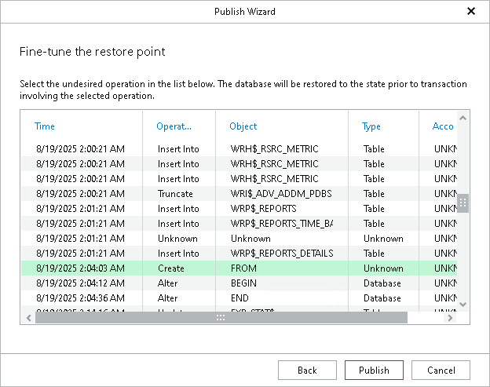

# Step 3. Fine-Tune Restore Point

At this step of the wizard, select an operation prior to which you want to publish your database and click Publish.

|  |
| --- |
| Note |
| This step is available only if you have selected the Perform restore to the specific transaction check box at the [Specify Restore Point](veor_srp.md) step of the wizard. |

[For Windows-based Oracle servers] If the user specified in the job is not the Oracle home user, you must provide a password to access the target Oracle home. Applicable to Oracle 12c and later versions.

You can enter the Oracle home user password when you configure the staging server. For more information, see [Configuring Staging Oracle Server](veor_staging_server.md#staging_windows).

