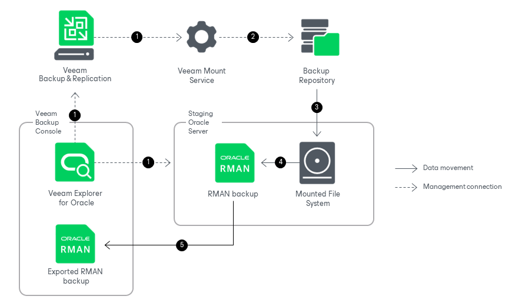
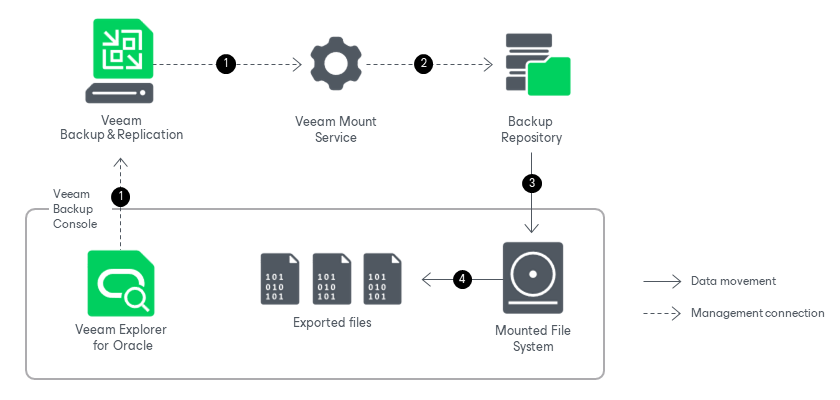

# How Export Works

In this article

Veeam Explorer for Oracle allows you to export standalone databases and Data Guard databases to the machine where Veeam Explorer for Oracle is running. You can export your data as RMAN backups and as database files.

Export as RMAN Backup

Exporting standalone databases and Data Guard databases as RMAN backups works in the following manner:

1. Veeam Explorer for Oracle connects to the Veeam Mount Service and the staging server and performs a series of validations. For example, it checks if the staging server has enough free space for the staged RMAN backup.

Some aspects of the validation process vary depending on the operating system of the Oracle machine.

* For Windows machines, Veeam Explorer for Oracle deploys the Veeam Oracle Restore Service on the staging server. This non-persistent runtime component checks the valid rights assignments required for export, gets information about the databases, and later performs required file operations. The Veeam Oracle Restore Service is removed from the staging server once the export process is completed.

* For Linux machines, Veeam Explorer for Oracle performs the necessary validations, for example, validating the SSH fingerprints of the target server, without deploying a non-persistent runtime component.

1. Veeam Explorer for Oracle sends an export command to the Veeam Mount Service running on the mount server associated with the backup repository. The service connects to the backup repository and prepares the mounting operation.
2. The Veeam Mount Service mounts the necessary file system to the staging Oracle server. Mounting is done to the C:\VeeamFLR directory for Windows machines or the /run/media directory for Linux machines. For more information, see [How Mounting Works](veo_mount.md).
3. On the staging Oracle server, Veeam Oracle Restore Service (for Windows machines) or Veeam Explorer for Oracle itself (for Linux machines) uses native Oracle RMAN functionality to create a backup of the database. The backup is saved to the C:\Windows\TEMP directory for Windows machines or to the /var/tmp directory for Linux machines.
4. The Veeam Oracle Restore Service (for Windows machines) or Veeam Explorer for Oracle itself (for Linux machines) sends the staged RMAN backup to the machine where Veeam Explorer for Oracle is running. Data transfer is established by data movers running on the staging server and the target machine.

Note that Data Guard databases are exported as standalone Oracle databases, preserving no Data Guard infrastructure.

After the export operation successfully completes, Veeam Explorer for Oracle unmounts the mounted file system and removes the RMAN backup from the staging server.

Export Database Files

Exporting standalone databases and Data Guard databases as database files relies on different processes and infrastructure components depending on the operating system of the Oracle machine.

Exporting Database Files for Windows Machines

Exporting database files from a backup of a Windows machine with Oracle works in the following manner:

1. Veeam Explorer for Oracle connects to the Veeam Mount Service running on the mount server associated with the backup repository.
2. Veeam Explorer for Oracle sends an export command to the Veeam Mount Service. The service connects to the backup repository and prepares the mounting operation.

1. The Veeam Mount Service mounts the necessary file system to the C:\VeeamFLR directory of the machine where Veeam Explorer for Oracle is running. For more information, see [How Mounting Works](veo_mount.md).
2. Veeam Explorer for Oracle saves database files and archived redo logs from the mounted file system to the native file system of the machine where Veeam Explorer for Oracle is running.

Note that Data Guard databases are exported as standalone Oracle databases, preserving no Data Guard infrastructure.

After the export process successfully completes, Veeam Explorer for Oracle unmounts the mounted file system.

Exporting Database Files for Linux Machines

Exporting database files from a backup of a Linux machine with Oracle works in the following manner:

1. Veeam Explorer for Oracle connects to the Veeam Mount Service and the staging server and performs a series of validations. For example, it checks if the target machine has enough free space for the exported files.
2. Veeam Explorer for Oracle sends an export command to the Veeam Mount Service running on the mount server associated with the backup repository. The service connects to the backup repository and prepares the mounting operation.
3. The Veeam Mount Service mounts the necessary file system to the /run/media directory of the staging Oracle server. For more information, see [How Mounting Works](veo_mount.md).

1. Veeam Explorer for Oracle transfers database files and archived redo logs from the mounted file system to the machine where Veeam Explorer for Oracle is running. Data transfer is established by data movers running on the staging server and the target machine.

Note that Data Guard databases are exported as standalone Oracle databases, preserving no Data Guard infrastructure.

After the export process successfully completes, Veeam Explorer for Oracle unmounts the mounted file system from the staging server.

Page updated 11/25/2025

Page content applies to build 13.0.1.1071
