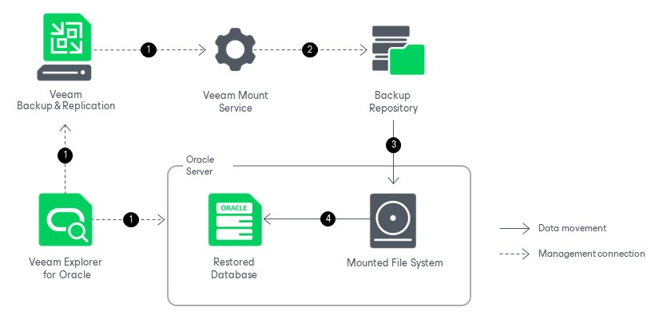

# How Restore Works

Restoring standalone databases or Data Guard databases with Veeam Explorer for Oracle works in the following manner:

1. Veeam Explorer for Oracle connects to the target server and performs a series of validations. For example, it checks if the target server has enough free space for the restored database.

Some aspects of the validation process vary depending on the operating system of the Oracle machine.

* For Windows machines, Veeam Explorer for Oracle deploys the Veeam Oracle Restore Service on the target server and, if you restore your data up to a specific transaction, on the staging server. This non-persistent runtime component checks the valid rights assignments required for database recovery, gets information about the databases, and later performs required file operations including database and transaction logs copy. The Veeam Oracle Restore Service is removed from the target and the staging server once the restore process is completed.
* For Linux machines, Veeam Explorer for Oracle performs the necessary validations, for example, validating the SSH fingerprints of the target server, without deploying a non-persistent runtime component.

1. Veeam Explorer for Oracle sends a restore command to the Veeam Mount Service running on the mount server associated with the backup repository. The service connects to the backup repository and prepares the mounting operation.
2. The Veeam Mount Service mounts the necessary file system to the target Oracle machine. Mounting is done to the C:\VeeamFLR directory for Windows machines or the /run/media directory for Linux machines. For more information, see [How Mounting Works](veo_mount.md).
3. The Veeam Oracle Restore Service (for Windows machines) or Veeam Explorer for Oracle itself (for Linux machines) copies the database files and archived redo logs from the mounted file system to the native file system of the target machine and starts the restored database.

During this process, temporary files (such as scripts, archive logs and cache files) are created and saved in different locations depending on the operating system of the Oracle machine.

* For Windows machines, cache files are stored on the mount server and the remaining temporary files are stored in the C:\Windows\Temp folder of the target server. For more information on how to configure the mount server and the write cache folder, see [Specify Mount Server Settings](repository_mount_server.md).
* For Linux machines, all temporary files are stored in the /var/tmp or /tmp folder on the target server, depending on which folder has more free space.

After the restore operation successfully completes, temporary files created during the restore operation are removed and the mounted file system is unmounted from the target server.

When restoring Data Guard databases, consider the following:

* If the primary and standby databases were backed up in a single job, restoring a Data Guard database (primary or standby) to the original location restores the entire Data Guard infrastructure, with all databases.
* If the Data Guard has physical standby databases, only the backup of the primary database is mounted to the server hosting the primary database. After the primary database is restored, the standby databases are created from the restored database.

