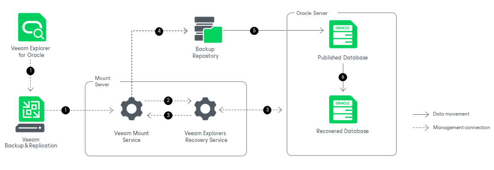

# How Instant Recovery Works

To perform instant recovery, Veeam Explorer for Oracle uses the Veeam Explorers Recovery Service running on the mount server associated with the backup repository. This removes the necessity to keep Veeam Explorer for Oracle open during an entire instant recovery session. Once the instant recovery session is started, you can close Veeam Explorer for Oracle and then open it later when necessary.

As you complete the steps of the Instant Recovery wizard, Veeam Explorer for Oracle performs a series of validations. For example, it tests the connection to the target server and validates the SSH fingerprints of Linux machines.

After you complete the steps of the wizard, instant recovery of standalone databases and Data Guard databases works in the following manner:

1. To start the instant recovery process, Veeam Explorer for Oracle sends an instant recovery command to the Veeam Mount Service. The service runs on the mount server associated with the backup repository.
2. The Veeam Mount Service delegates this request to the Veeam Explorers Recovery Service running on the same server.
3. The Veeam Explorers Recovery Service connects to the target server and performs a series of validations. For example, it checks if the target server has enough available memory for the published and the recovered database.

Some aspects of the validation process vary depending on the operating system of the Oracle machine.

* For Windows machines, Veeam Explorers Recovery Service deploys Veeam Oracle Restore Service non-persistent runtime components on the target server, and if you recover your data up to a specific transaction, on the staging server. Two runtime components are deployed for each database that is being recovered. These runtime components check the valid rights assignments required for database recovery, get information about the databases, and later perform required file operations including database and transaction logs copy.

The Veeam Oracle Restore Service runtime components are removed from the target and the staging server when you perform switchover or cancel the instant recovery session.

* For Linux machines, Veeam Explorers Recovery Service performs the necessary validations, for example, validating the SSH fingerprints of the target server, without deploying a non-persistent runtime component.

1. The Veeam Explorers Recovery Service sends a request to the Veeam Mount Service to connect to the backup repository and initiate the mounting operation.
2. The Veeam Mount Service mounts the necessary file system from the backup repository to the target Oracle machine. Mounting is done to the C:\VeeamFLR directory for Windows machines or the /run/media directory for Linux machines. For more information, see [How Mounting Works](veo_mount.md). The Veeam Explorers Recovery Service then starts the instance from the mounted file system.
3. Once the published database is online, the Veeam Explorers Recovery Service copies the database to the target Oracle server. The recovered database is continuously synchronized with the changes on the published instance, using archived redo logs.

All changes to the published database are saved in the instant recovery write cache, whose location depends on the operating system of the Oracle machine.

* For Windows machines, the write cache is by default stored in the C:\ProgramData\Veeam\Backup\IRCache\ folder on the mount server. For more information on how to configure the write cache folder, see [Specify Mount Server Settings](repository_mount_server.md).
* For Linux machines, the write cache is stored in the /var/lib/veeam/IRCache folder on the target server.

Note that Data Guard databases are recovered as standalone Oracle databases, preserving no Data Guard infrastructure.

After synchronization, you can switch over to the recovered database. For more information about the available switchover options, see [Switchover](veor_switchover.md).

During switchover, the Veeam Oracle Restore Service (for Windows machines) or the Veeam Explorers Recovery Service (for Linux machines) does the following:

1. Stops the published database.
2. Uses redo logs to synchronize the remaining differences between the published database and the recovered database.
3. Drops the published database.
4. Starts the recovered database.

The instant recovery session is resilient to network disruptions, backup server or mount server crashes. If anything disrupts the recovery process, the recovery process stays in the waiting mode and performs 10 automatic retries every 5 minutes. If the retries fail, you can launch retry after the server or network is up.

