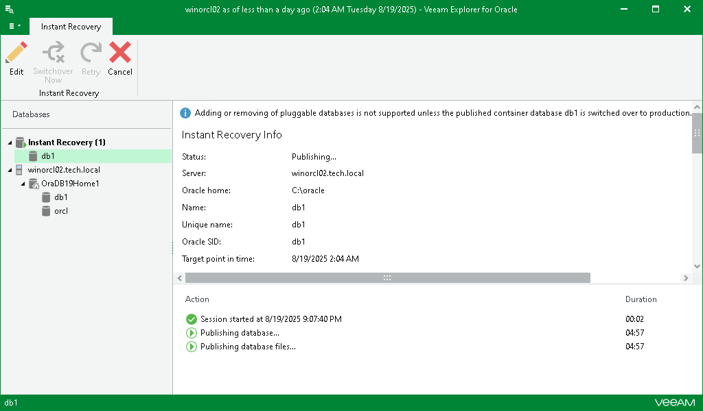

# Managing Instant Recovery Session

After you finish steps of the Instant Recovery wizard, Veeam Explorer for Oracle starts an instant recovery session which shows the progress of the recovery process.

Depending on the option you choose in the Instant Recovery wizard, switchover starts in one of the following ways:

* Automatically, immediately after synchronization
* Automatically, according to a specified schedule
* Manually

If you have selected the Manual switchover option, you must perform switchover manually as described in [Starting Switchover Manually](veor_manual_switchover.md).

|  |
| --- |
| Note |
| The instant recovery session closes automatically after switchover. |

Also, in the Instant Recovery session view, you can do the following:

* [Edit switchover settings](veor_instant_edit_settings.md).
* [Retry instant recovery](veor_retry.md) (in case instant recovery session fails for any reason).
* [Cancel instant recovery](veor_instant_cancel.md).

