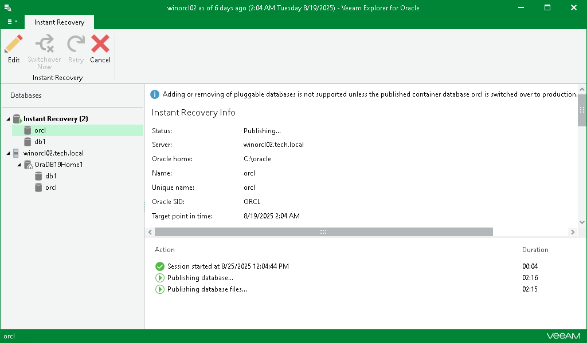

# Step 3. Finalize Instant Recovery Session

Depending on the option you choose in the Instant Recovery wizard, switchover starts in one of the following ways:

* Automatically, immediately after synchronization
* Automatically, according to a specified schedule
* Manually

If you have selected the Manual switchover option, you must perform switchover manually as described in [Starting Switchover Manually](veor_manual_switchover.md).

Related Topics

* [Managing Instant Recovery Session](veor_instant_session.md)
* [Switchover](veor_switchover.md)

