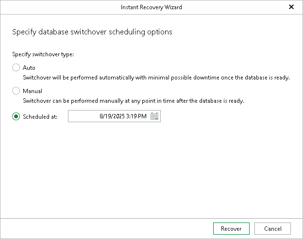

# Step 3. Specify Switchover Settings

At this step of the wizard, specify database switchover options.

To select a switchover option and start the instant recovery session, do the following:

1. At the Specify switchover type field, select one of the following switchover options:

* Auto: switchover is performed automatically after all database files are copied and synchronized.
* Manual: switchover is started manually by user at any time after all database files are copied and synchronized.

* Scheduled: switchover is performed at a specified date and time. Use the drop-down calendar to specify the date and time.

1. Click Recover.

After you click Recover, Veeam Explorer for Oracle starts publishing the database on the target server.

|  |
| --- |
| Note |
| Before the restore process begins, you will be prompted to enter the source machine credentials. |

[For Windows-based Oracle servers] If the user specified in the job is not the Oracle home user, you must provide a password to access the target Oracle home. Applicable to Oracle 12c and later versions.

