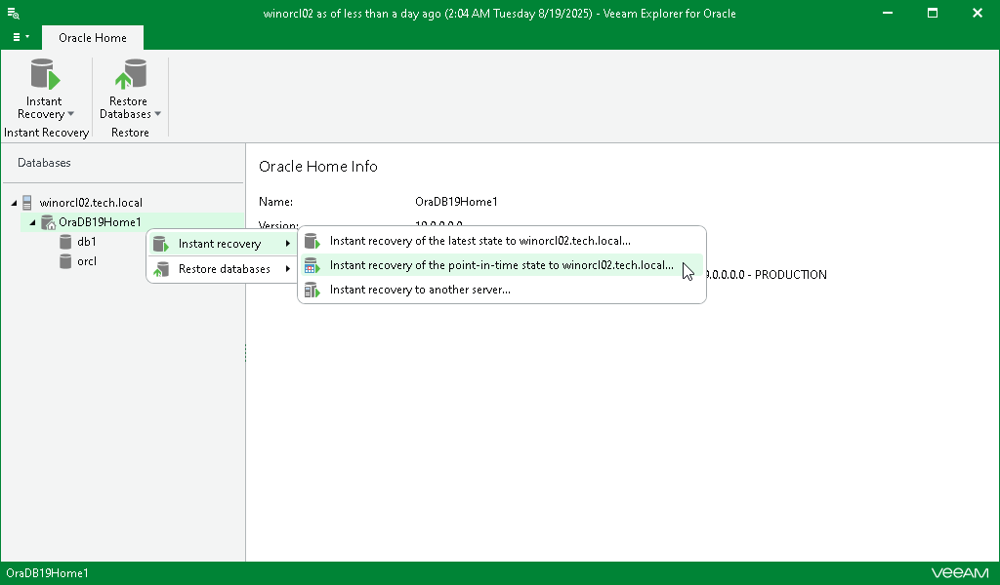

# Step 1. Launch Instant Recovery Wizard

To launch the Instant Recovery wizard, do the following:

1. In the navigation pane, select the Oracle server or an Oracle home.
2. On the Server or Oracle Home tab, select Instant Recovery > Instant recovery of point-in-time state to <original server>.

Alternatively, you can right-click the Oracle server or an Oracle home and select Instant recovery > Instant recovery of point-in-time state to <original server>.

[For Windows-based Oracle servers] If the user specified in the job is not the Oracle home user, you must provide a password to access the target Oracle home. Applicable to Oracle 12c and later versions.

