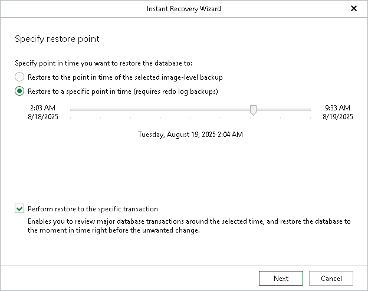

# Step 2. Specify Restore Point

In this article

At this step of the Instant Recovery wizard, select a state as of which you want to restore your database:

* Select the Restore to the point in time of the selected image-level backup option to load database files as of the moment when the current restore point was created.

* Select the Restore to a specific point in time option to load database files as of the selected point in time. This option is available only if archived log backups exist. For more information, see [Required Job Settings](veo_bu_job_settings.md).

1. Use the slider to choose the point in time you need.
2. If you want to load database files exactly as of the moment before undesired transactions, select the Perform restore to the specific transaction check box. Note that this option requires a staging Oracle server. For more information, see [Configuring Staging Oracle Server](veor_staging_server.md).

Page updated 8/19/2025

Page content applies to build 13.0.1.1071
