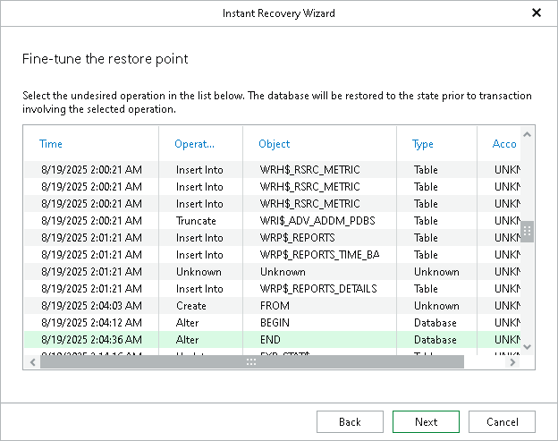

# Step 3. Fine-Tune Restore Point

In this article

At this step of the wizard, select an operation prior to which you want to restore the database.

|  |
| --- |
| Note |
| This step is available only if you have selected the Perform restore to the specific transaction check box at the [Specify Restore Point](veor_ir_single_tas_specify_restore_point.md) step of the wizard. |

Page updated 2/21/2024

Page content applies to build 13.0.1.1071
