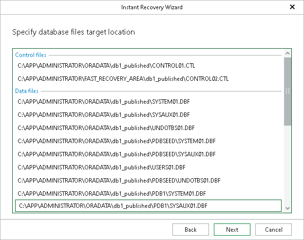

# Step 6. Specify Database File Location

At this step of the wizard, specify the location for database files (control files, data files, log files and temp files).

To edit the path, click the path row and provide the location you want to use. If specified folders do not exist, Veeam Explorer for Oracle will create these folders.

