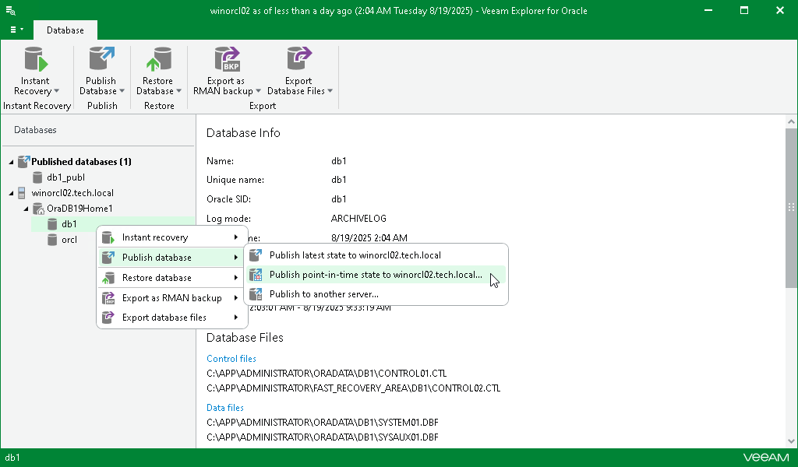

# Step 1. Launch Publish Wizard

To launch the Publish wizard, do the following:

1. In the navigation pane, select a database.
2. On the Database tab, select Publish Database > Publish point-in-time state to <server\_name>.

Alternatively, you can right-click a database and select Publish database > Publish point-in-time state to <server\_name>.

Once completed, the database will be published with the same name as during the [initial](veor_ptsr.md) publishing session.

