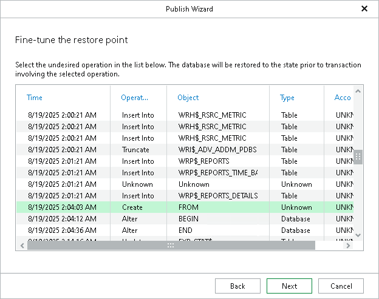

# Step 3. Fine-Tune Restore Point

At this step of the wizard, select an operation prior to which you want to publish your database.

|  |
| --- |
| Note |
| This step is available only if you have selected the Perform restore to the specific transaction check box at the [Specify Restore Point](veor_ptsr_restore_point.md) step of the wizard. |

