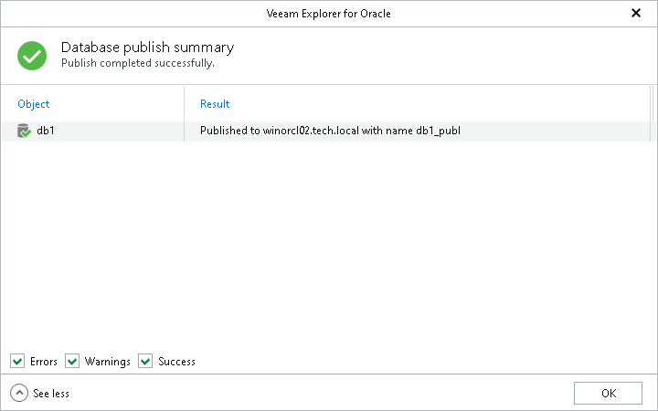

# Step 4. Review Publish Summary

In this article

At the Database publish summary step, click See more to expand the window and review details of the publishing operation.

You can filter notifications by their status: Error, Warning or Success.

Page updated 9/26/2024

Page content applies to build 13.0.1.1071
