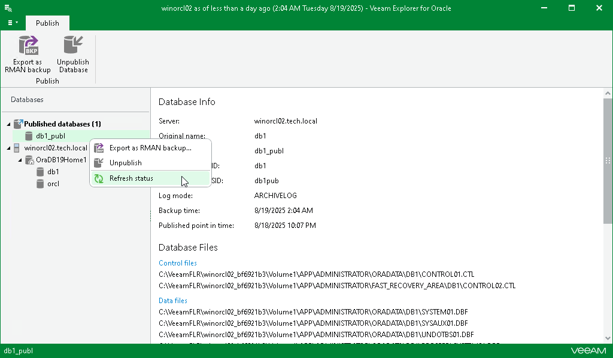

# Refreshing Database Status

While databases are attached to the target Oracle server, Veeam Explorer for Oracle synchronizes each published database state to verify its availability. By default, synchronization occurs every 5 seconds.

If something went wrong with any of the published databases, the question mark appears next to each of such databases indicating the database unavailability. In the Database Info section, you will also see the notification message describing the problem.

To refresh a published database state manually, in the navigation pane, under the Published databases node, right-click a published database and select Refresh status.

