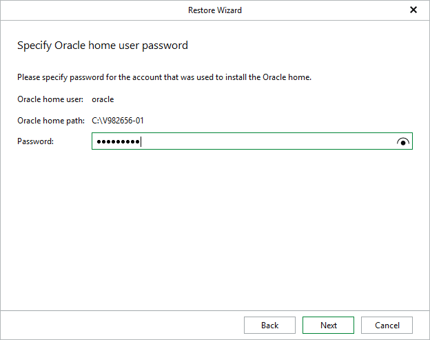

# Step 2. Specify Restore Point

At this step of the wizard, select a state as of which you want to restore your databases.

1. Choose a restore point:

* Select the Restore to the point in time of the selected image-level backup option to load database files as of the moment when the current restore point was created.

* Select the Restore to a specific point in time option to obtain database files as of the selected point in time within the available restore period. Use the slider to choose the point in time you need.

Note that the Restore to a specific point in time option is available only if archived log backups exist. For more information, see [Required Job Settings](veo_bu_job_settings.md).

1. Click Restore.

|  |
| --- |
| Note |
| Before the restore process begins, you will be prompted to enter the source machine credentials. |

[For Windows-based Oracle servers] If the user specified in the job is not the Oracle home user, you must provide a password to access the target Oracle home. Applicable to Oracle 12c and later versions.

