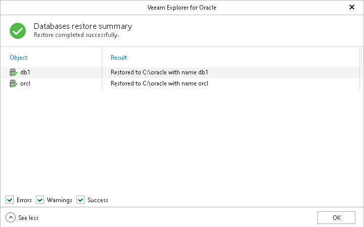

# Step 3. Review Restore Summary

In this article

At the Databases restore summary step, click See more to expand the window and review details of the restore operation.

You can filter notifications by their status: Error, Warning or Success.

Page updated 9/25/2024

Page content applies to build 13.0.1.1071
