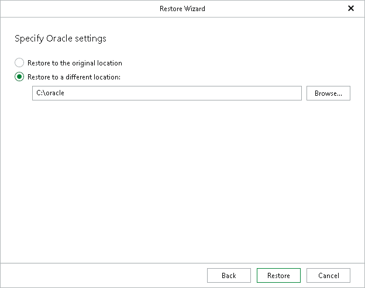

# Step 4. Specify Oracle Settings

At this step of the wizard, select a location to which you want to restore the databases.

1. Choose a target location:

* Restore to the original location: Veeam Explorer for Oracle checks if the target server has any Oracle home directories. If these home directories exist, the databases are restored. If they do not exist, the databases are not restored and Veeam Explorer for Oracle issues an error that suitable home directories have not been found.
* Restore to a different location: Veeam Explorer for Oracle restores all databases to a custom location. To specify the Oracle home directory, click Browse and select a folder that you want to use. Alternatively, you can manually enter the target location.

1. Click Restore.

[For Windows-based Oracle servers] If the account specified in the previous step is not the Oracle home user, you must provide a password to access the target Oracle home. Applicable to Oracle 12c and later versions.

