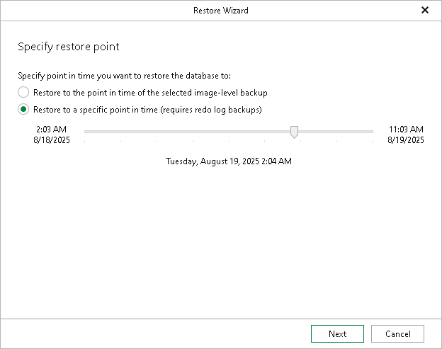

# Step 2. Specify Restore Point

At this step of the wizard, select a state as of which you want to restore the databases:

* Select the Restore to the point in time of the selected image-level backup option to load database files as of the moment when the current restore point was created.

* Select the Restore to a specific point in time option to load database files as of the selected point in time. Use the slider to choose the point in time you need.

Note that this option is available only if archived log backups exist. For more information, see [Required Job Settings](veo_bu_job_settings.md).

If the backed-up archived logs do not contain information about some databases for the selected point in time, those databases will be recovered as of their latest available state.

