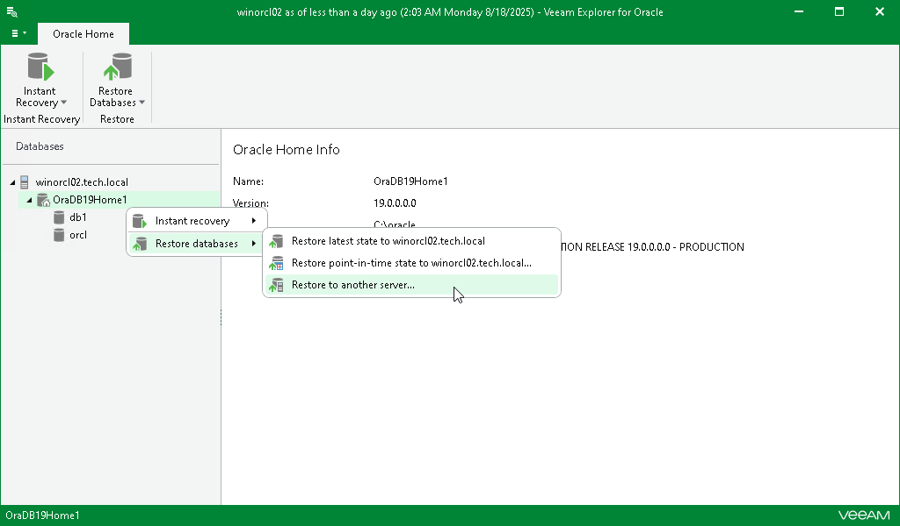

# Step 1. Launch Restore Wizard

To launch the Restore wizard, do the following:

1. In the navigation pane, select the Oracle server or an Oracle home.
2. On the Server or Oracle Home tab, select Restore Databases > Restore to another server.

Alternatively, you can right-click the Oracle server or an Oracle home and select Restore databases > Restore to another server.

