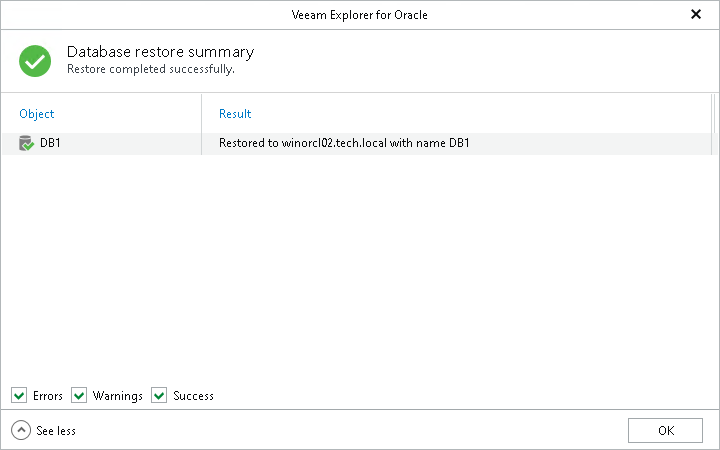

# Step 10. Review Restore Summary

In this article

At the Database restore summary step, click See more to expand the window and review details of the restore operation.

You can filter notifications by their status: Error, Warning or Success.

Page updated 8/25/2025

Page content applies to build 13.0.1.1071
