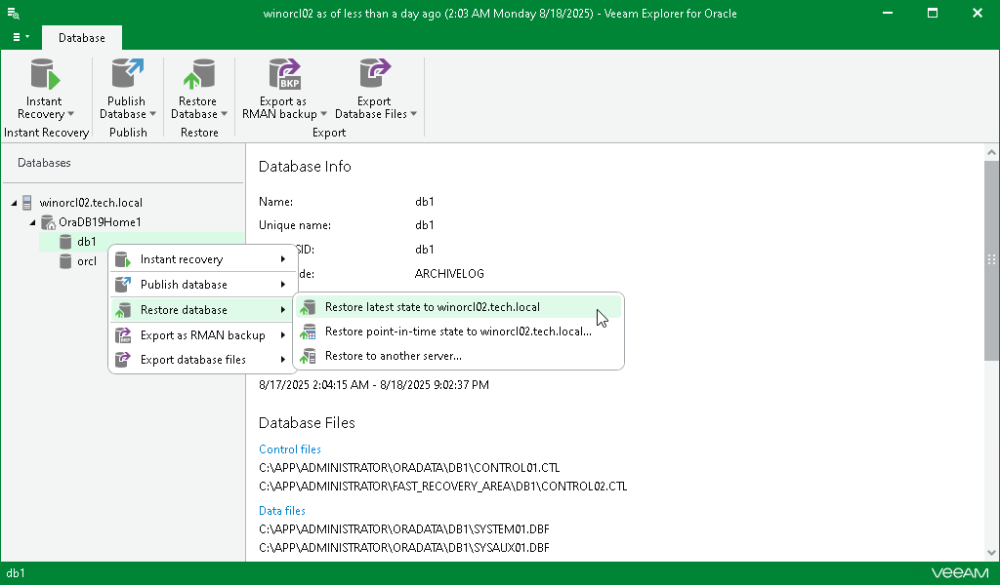

# Restoring Latest State

To restore a standalone database or Data Guard database to the latest state on the backup file, do the following:

1. In the navigation pane, select a database.
2. On the Database tab, select Restore Database > Restore latest state to <original\_location>.

Alternatively, you can right-click a database and select Restore database > Restore latest state to <original\_location>.

|  |
| --- |
| Note |
| The name of the restore option depends on the restore point you select during the [application item restore](restore_veeam_explorers.md) process in the Veeam Backup & Replication console.   * If you select the most recent available restore point, the option name is displayed as Restore latest state to <original\_location>. * If you select any other restore point, the option name is displayed as Restore state of <point\_in\_time> to <original\_location>. |

[For Data Guard restore] Veeam Explorer for Oracle restores the primary node first and then uses it to restore the remaining nodes and the Data Guard infrastructure. This sequence is the same even if you launch restore from a standby node.

Before the restore process begins, you will be prompted to enter the source machine credentials.

[For Windows-based Oracle servers] If the user specified in the job is not the Oracle home user, you must provide a password to access the target Oracle home. Applicable to Oracle 12c and later versions.

After the restore process is complete, review the results shown in the Database restore summary window. To do this, click See more to expand the window and review details of the restore operation.

You can filter notifications by their status: Error, Warning or Success.

