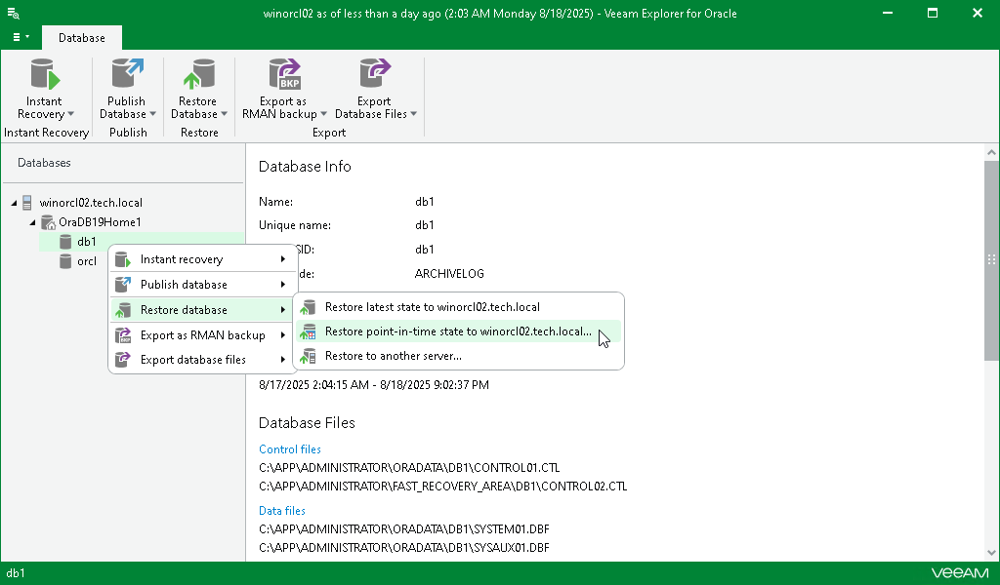

# Step 1. Launch Restore Wizard

To launch the Restore wizard, do the following:

1. In the navigation pane, select a database.
2. On the Database tab, select Restore Database > Restore point-in-time state.

Alternatively, you can right-click a database and select Restore database > Restore point-in-time state.

|  |
| --- |
| Important |
| The point-in-time restore option is only available if the ARCHIVELOG mode is enabled. |

[For Data Guard restore] Veeam Explorer for Oracle restores the primary node first and then uses it to restore the remaining nodes and the Data Guard infrastructure. This sequence is the same even if you launch restore from a standby node.

