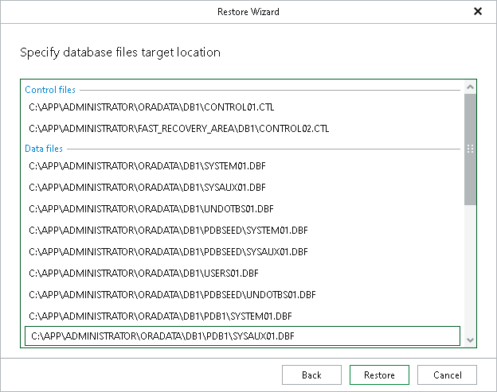

# Step 6. Specify Database Files Location

In this article

At this step of the wizard, specify the location for database files and click Restore.

To edit the path, click the path row and provide the location you want to use.

Page updated 8/19/2025

Page content applies to build 13.0.1.1071
