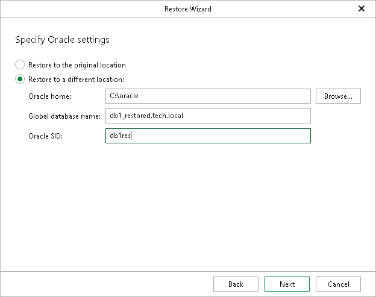

# Step 5. Specify Oracle Settings

At this step of the wizard, specify the location to which you want to restore the database.

* Select Restore to the original location to restore the database back to the original location.
* Select Restore to a different location to restore the database to a custom location.

1. In the Oracle home field, specify the Oracle home directory. To locate the Oracle home directory, click Browse and select the folder you want to use.
2. In the Global database name field, specify the global database name as DB\_NAME.DB\_DOMAIN, where:

* DB\_NAME is the database name. Oracle limits the length of the database name to 8 characters. If the database name you specify exceeds this limit, Veeam Explorer for Oracle will automatically shorten the database name, and hence the global database name, during the restore process.

The value you specify is also used for the unique database name (DB\_UNIQUE\_NAME). The unique database name can contain up to 30 characters.

* DB\_DOMAIN is the domain name of the database. It does not count towards any character limits and Veeam Explorer for Oracle does not shorten it during the restore process.

For example, if you specify the global database name as orcl\_restored.tech.local, Veeam Explorer for Oracle will shorten it to orcl\_res.tech.local. The database name will be orcl\_res, while the unique database name will be orcl\_restored.

1. In the Oracle SID field, specify the database system identifier. The Oracle SID field is automatically filled with the value entered in the Global database name field, but you can also assign a different value.

The maximum length of the Oracle SID is 12 characters and it can only contain alphanumeric characters (a-z, A-Z and 0-9).

[For Windows-based Oracle servers] If the account specified in the previous step is not the Oracle home user, you must provide a password to access the target Oracle home. Applicable to Oracle 12c and later versions.

Note that this window will not appear if you are restoring your data as of a specific transaction and entered the Oracle home user password when configuring the staging server. For more information, see [Configuring Staging Oracle Server](veor_staging_server.md#staging_windows).

