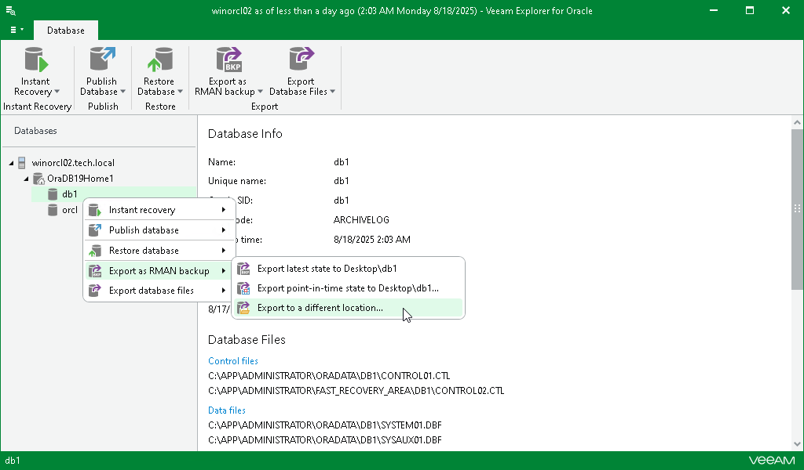

# Step 1. Launch Export Wizard

To launch the Export wizard, do the following:

1. In the navigation pane, select a database.
2. On the Database tab, select Export as RMAN backup > Export to a different location.

Alternatively, you can right-click a database and select Export as RMAN backup > Export to a different location.

