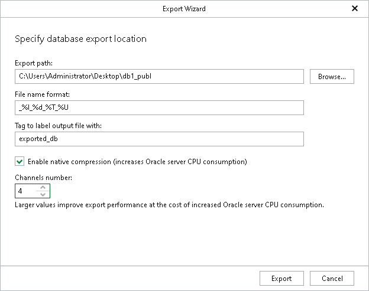

# Step 4. Specify Export Location

At this step of the wizard, do the following:

1. In the Export path field, specify the location on the machine where Veeam Explorer for Oracle is running to which you want to export database files.

If the folder you are specifying does not exist, it will be created.

1. In the File name format field, specify the format according to which your files will be named after the export.

For more information, see [this Oracle article](https://docs.oracle.com/en/database/oracle/oracle-database/21/rcmrf/formatSpec.html?source=%3Aso%3Atw%3Aor%3Aawr%3Aore%3A%3A%3Aautonmousblog#GUID-E51F637A-57E0-4B06-803F-3F879DF5BEED).

1. In the Tag to label output file with field, specify a new tag name.
2. To compress files using native Oracle compression, select the Enable native compression check box.
3. In the Channels number numeric field, specify the number of channels to be used when retrieving Oracle databases from the backup.
4. Click Export.

