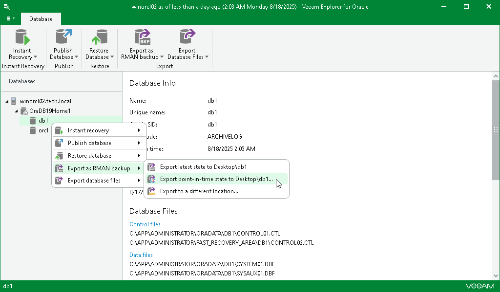

# Step 1. Launch Export Wizard

To launch the Export wizard, do the following:

1. In the navigation pane, select a database.
2. On the Database tab, select Export as RMAN backup > Export point-in-time state to Desktop\<db\_name>.

Alternatively, you can right-click a database and select Export as RMAN backup > Export point-in-time state to Desktop\<db\_name>.

Note that Veeam Explorer for Oracle exports files in the following format: \_%I\_%d\_%T\_%U. For more information, see [this Oracle article](https://docs.oracle.com/en/database/oracle/oracle-database/21/rcmrf/formatSpec.html?source=%3Aso%3Atw%3Aor%3Aawr%3Aore%3A%3A%3Aautonmousblog#GUID-E51F637A-57E0-4B06-803F-3F879DF5BEED). To set a different export format, use [Exporting to Custom Location](veor_rman_custom_export.md).

