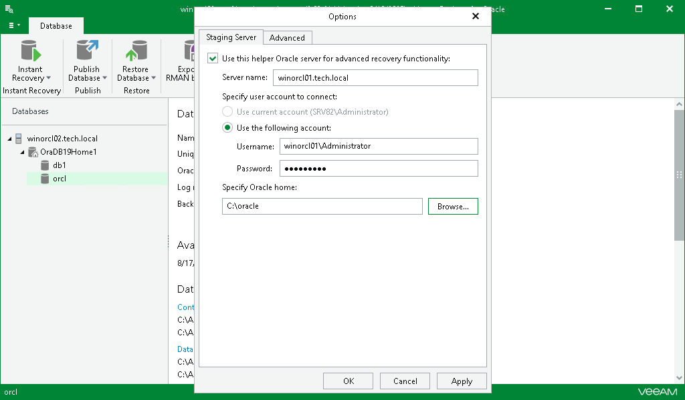
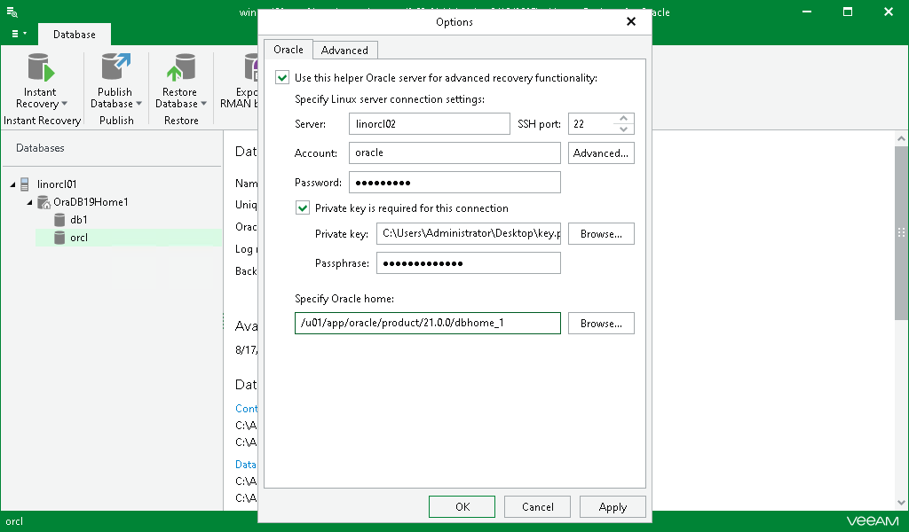

# Configuring Staging Oracle Server

In this article

To enable advanced recovery functionality, you can use an Oracle machine as a staging server. This section explains the use cases of the staging server and how to configure it.

A staging server is required in the following cases:

* When you export Oracle databases, as described in [Data Export](veor_data_export.md). In this case, a staging server is not necessary only when you export database files from a backup of a Windows-based Oracle machine.
* When you restore, export, publish, and instantly recover your data up to a specific transaction. For example, see [Fine-Tune Restore Point](veor_restore_single_pit_fine_tune.md).
* When you explore backups created without application-aware image processing. For more information, see [Exploring Oracle Backups](veor_exploring.md).

Consider the following:

* The staging server must have the same operating system and the same Oracle version as both the source and target Oracle servers.

* If you plan to restore databases with Automatic Storage Management enabled, both staging and target servers must have ASM enabled.
* Oracle Database Express Edition cannot be used as a staging system.

For Windows-based Oracle Servers

To configure a staging server for Windows-based Oracle servers, do the following:

1. Go to the main menu and click General Options.
2. On the Staging Server tab, select the Use this helper Oracle server for advanced recovery functionality check box and do the following:

1. In the Server name field, specify the DNS name or IP address of the server that you want to use as an Oracle staging server.
2. In the Specify user account to connect section, select one of the following options:

* Use current account. To connect to the specified server using the current user account under which Veeam Explorer for Oracle running.
* Use the following account. To connect to the specified server under a custom user account.

When using a custom account, in the Username field, specify a user name and in the Password field, provide the password.

1. Specify the path to Oracle home. Click Browse to browse for the Oracle home directory.

[For Windows-based Oracle servers] If the specified account is not the Oracle home user, there will be an additional field where you can provide a password to access the target Oracle home. Applicable to Oracle 12c and later versions.

1. Click OK to finish the configuration and close the window.

For Linux-based Oracle Servers

To configure a staging server for Linux-based Oracle servers, do the following:

1. Go to the main menu and click General Options.
2. On the Oracle tab, select the Use this helper Oracle server for advanced recovery functionality check box and do the following:

1. In the Server field, specify the DNS name or IP address of the server that you want to use as an Oracle staging server.
2. In the SSH port field, specify the port number.
3. In the Account field, specify a user account under which to connect to the specified server.
4. If you specify data for a non-root account that does not have root permissions on a Linux server, click Advanced to grant sudo rights to this account.

1. To provide a non-root user with root account privileges, select the Elevate specified account to root check box.
2. To add the user account to the sudoers file, select the Add account to the sudoers file automatically check box. In the Root password field, enter the password for the root account.

If you do not enable this option, you will have to manually add the user account to the sudoers file.

1. When registering a Linux-based server, you have an option to failover to using the su command for distros where the sudo command is not available.

To enable the failover, select the Use su if sudo is unavailable check box and in the Root password field, enter the password for the root account.

1. In the Password field, specify the password.
2. If the private key is required to connect to the selected server, do the following:

1. Select the Private key is required for this connection check box.
2. In the Private key field, specify a key. To select a key, click Browse and select a key.
3. In the Passphrase field, enter the passphrase.

1. Specify the path to Oracle home. Click Browse to browse for the Oracle home directory.
2. Click OK to finish the configuration and close the window.

Page updated 8/21/2025

Page content applies to build 13.0.1.1071
