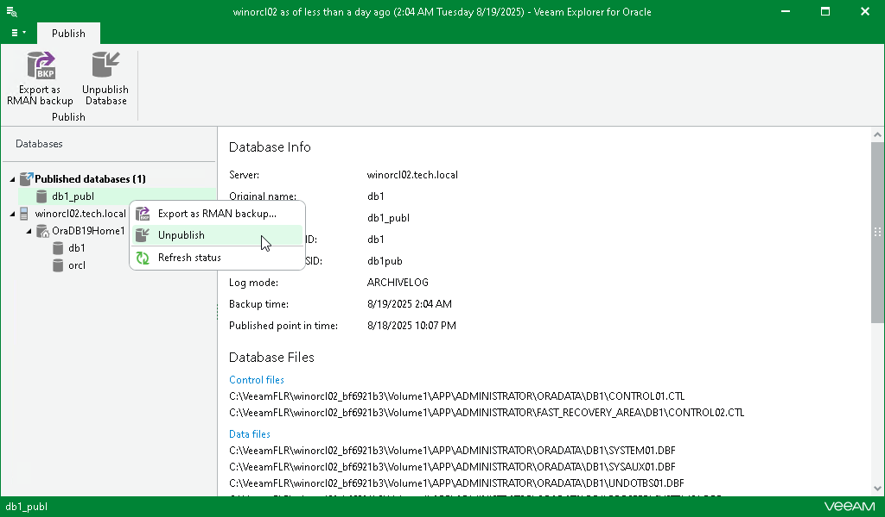

# Unpublishing Databases

In this article

Once you are finished working with published databases, you may want to unpublish (detach) these databases from the target Oracle server.

Detachment occurs in the following manner:

* Upon closing the Veeam Explorer for Oracle console, all published databases will be detached from the target Oracle server automatically. Mount points will be also dismounted from under the C:\VeeamFLR directory for Windows-based servers and the /run/media directory for Linux-based servers.
* On manual unpublishing, databases will be detached at once but the restore point will remain mounted on the target server for the next 15 minutes.

To unpublish a database manually, do the following:

1. In the navigation pane, under the Published databases node, select a published database.
2. On the Publish tab, select Unpublish Database.

Alternatively, in the navigation pane, right-click a published database and select Unpublish.

To detach more than one published database simultaneously, right-click the root Published databases node and select Unpublish databases or select the root Published databases node and click Unpublish Databases on the Publish tab.

Page updated 8/29/2025

Page content applies to build 13.0.1.1071
