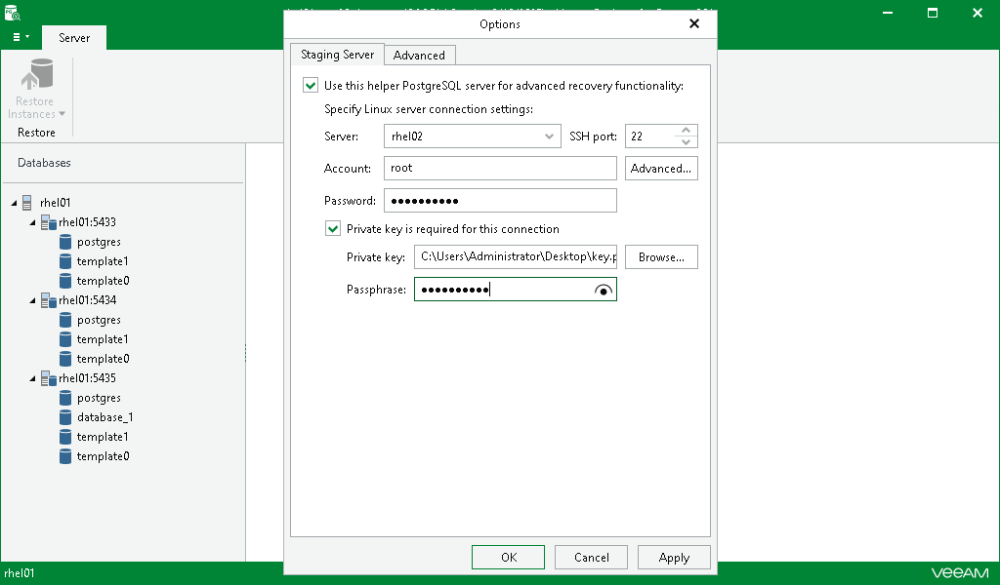

# Configuring Staging PostgreSQL Server

To enable advanced recovery functionality, you can use a PostgreSQL machine as a staging server. A staging server is required when exporting data, as described in [Data Export](vep_data_export.md).

The Linux machine used as a staging server can reside in the same domain as the machine hosting Veeam Explorer for PostgreSQL, as well as in a trusted domain or untrusted domain.

To configure a staging server, do the following:

1. Go to the main menu and click General Options.
2. On the Staging Server tab, select the Use this helper PostgreSQL server for advanced recovery functionality check box and do the following:

1. In the Server field, specify the DNS name or IP address of the PostgreSQL server to which you want to recover data.
2. In the SSH port field, specify the port number.
3. In the Account field, specify a user account under which to connect to the specified server.
4. If you specify data for a non-root account that does not have root permissions on a Linux server, click Advanced to grant sudo rights to this account.

1. To provide a non-root user with root account privileges, select the Elevate specified account to root check box.
2. To add the user account to the sudoers file, select the Add account to the sudoers file automatically check box. In the Root password field, enter the password for the root account.

If you do not enable this option, you will have to manually add the user account to the sudoers file.

1. When registering a Linux server, you have an option to failover to using the su command for distros where the sudo command is not available.

To enable the failover, select the Use su if sudo is unavailable check box and in the Root password field, enter the password for the root account.

1. In the Password field, specify the password.
2. If the private key is required to connect to the selected server, do the following:

1. Select the Private key is required for this connection check box.
2. In the Private key field, specify a key. To select a key, click Browse and select a key.
3. In the Passphrase field, enter the passphrase.

1. Click OK to finish the configuration and close the window.

