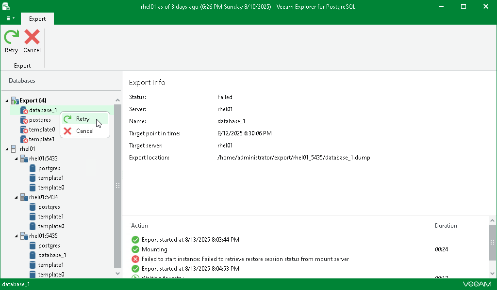

# Managing Export Session

In this article

After you finish the steps of the Export wizard, Veeam Explorer for PostgreSQL starts an export session for each of the selected databases.

Under the Export node in the upper part of the navigation pane, you can find the databases with an ongoing export process. Click a database to get a more detailed overview of the progress of its export session in the preview pane.

If the export process completes successfully or you cancel it, the database moves to the Completed node in the bottom section of the navigation pane.

At this step, you can also manually retry the export session if something interrupts it, or cancel the session.

Retrying Export

If anything disrupts the export process (the target or mount server crashes or the network is down), you can launch the retry manually after the server or network is up. You cannot manually launch retry of an ongoing export session.

To retry one or all ongoing export sessions, do the following:

1. In the navigation pane, click the Export node to select all ongoing restore sessions, or select the relevant database.
2. On the Export tab, select Retry.

Alternatively, you can right-click the Export node or the relevant database and select Retry.

Canceling Export

To cancel one or all ongoing export sessions, do the following:

1. In the navigation pane, click the Export node to select all ongoing export sessions, or select the relevant database.
2. On the Export tab, select Cancel.

Alternatively, you can right-click the Export node or the relevant database and select Cancel.

Page updated 8/13/2025

Page content applies to build 13.0.1.1071
