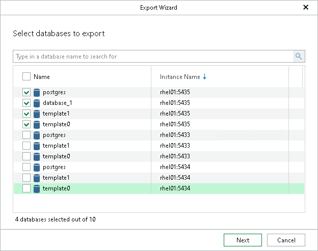

# Step 2. Select Databases

This step of the wizard is only available if you have selected an instance or the server at the [Launch Export Wizard](vep_export_wizard.md) step or you have launched the wizard from a published instance, as described in [Exporting From Published Instances](vep_published_export.md).

At this step of the wizard, select the databases that you want to export.

To quickly find the necessary databases, use the search field or sort the databases by name. If the databases belong to multiple instances, you can also sort the databases by instance name.

