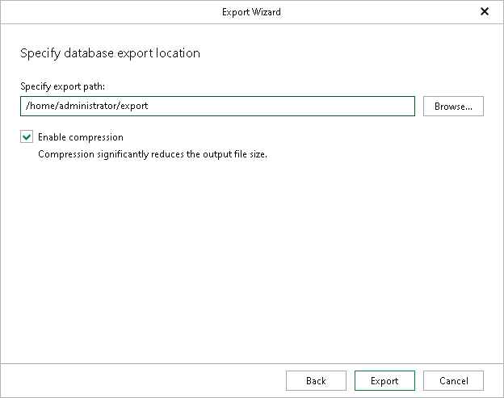

# Step 6. Specify Export Location

In this article

At this step of the wizard, specify the path to the directory where you want to export database files and click Export.

Click Browse to manually select the destination folder from the directory structure of the target server.

Select the Enable compression check box to compress the contents of the exported database.

|  |
| --- |
| Note |
| The account you are using must have a sufficient permission level to access the selected directory (Read and Write as minimum recommended). |

Page updated 10/31/2025

Page content applies to build 13.0.1.1071
