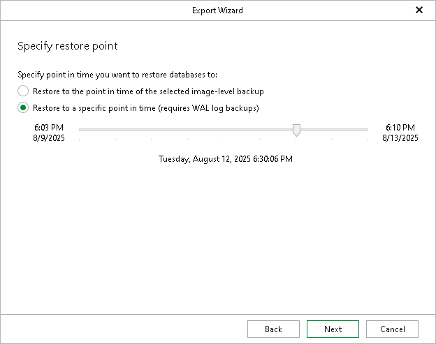

# Step 3. Specify Restore Point

At this step of the wizard, select a state as of which you want to recover your databases:

* Select the Restore to the point in time of the selected image-level backup option to load database files as of the moment when the current restore point was created.

* Select the Restore to a specific point in time option to obtain database files as of the selected point in time within the available restore period. Use the slider to choose the point in time you need.

The Restore to a specific point in time option is available only if backups of PostgreSQL write ahead log (WAL) files exist. For more information, see [Required Job Settings](vep_bu_job_settings.md).

Note that if the backed-up WAL files do not contain information about some databases for the selected point in time, the databases will be recovered as of their latest available state.

|  |
| --- |
| Note |
| Exporting backed-up PostgreSQL databases requires a staging PostgreSQL server. For more information, see [Configuring Staging PostgreSQL Server](vep_configure_staging.md). |

