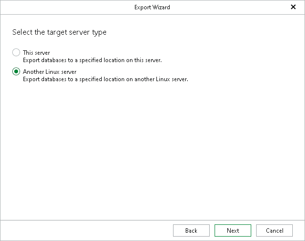

# Step 4. Specify Target Host

In this article

This step of the wizard is only available if you use a Windows-based backup server. If you use a Linux-based backup server, you will only be able to export your PostgreSQL databases to another Linux server.

At this step of the wizard, specify the server to which you want to export your PostgreSQL databases.

* Select This server to export your databases to the local host where Veeam Explorer for PostgreSQL is running.
* Select Another Linux server to export your databases to any Linux server.

Page updated 10/31/2025

Page content applies to build 13.0.1.1071
