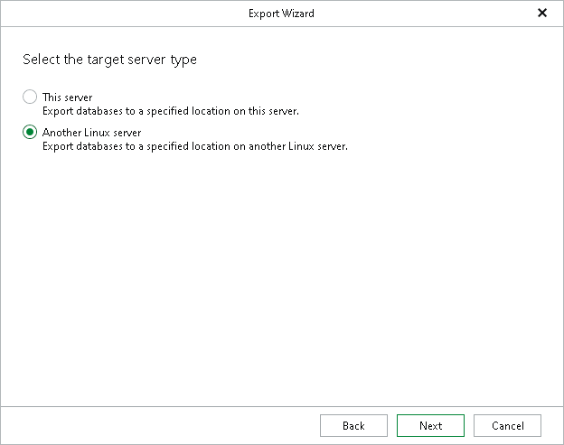

# Step 4. Specify Target Host

At this step of the wizard, select the type of server to which you want to export your PostgreSQL databases.

* Select Another Windows server to export your databases to a specified location on another Windows server.
* Select Another Linux server to export your databases to a specified location on another Linux server.

Page updated 2026-07-21

